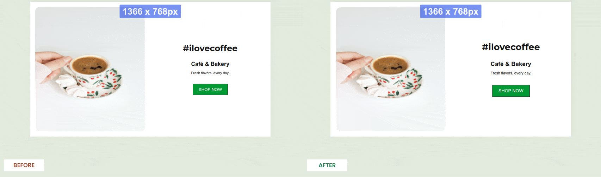

# responsive-app [beta]

This package contains the core functionalities to automatically handle your app responsiveness.

## Usage

There are two usage methods:

#### Plugins (recommended)

1. [Rollup and Vite](https://www.npmjs.com/package/rollup-plugin-responsive-app) or
2. [Webpack](https://www.npmjs.com/package/webpack-plugin-responsive-app)

_This package will be installed as a dependency._

#### Script tag (experimental)

```HTML
<head>
    <script src="https://cdn.jsdelivr.net/npm/responsive-app@1.0.7-beta.0/dist/browser-bundle.min.js"></script>
</head>
```

## Demo
The script will make sure your app proportions and relative sizes are all the same across different resolutions:



## How it's done

#### [A script](https://github.com/arthursb2016/responsive-app/blob/master/src/script.ts) will be added to your app entry point, which:

1. Has 8kb
2. Runs once the document is ready
3. Adds centralization rules for mobile screens
4. Adds the style transformations, converting pixels values to rem
5. Adds a window resize event listener that updates the HTML tag font-size based on the screen resolution and browser font-size

Notice your app HTML font-size to be different in each screen resolution. All properties with rem values will respond and adjust accordingly

## Beta phase

We are aiming to make the web responsive by one-line installation 🚀

Testing the solution across diverse contexts will enable us to build the most comprehensive solution as possible.

How to test:

1. Install or add the script tag into your fresh or existing app
    1. If you have existing responsive rules, bypass them
2. Check your interface across multiple resolutions
3. Let me know how it worked for you :)

You can reach out to me in [LinkedIn](https://www.linkedin.com/in/artsborba/) or open a [Github issue](https://github.com/arthursb2016/responsive-app/issues) to clear doubts, share feedback or demonstrate your context (either working or not)

Now check below options you can pass to the plugin constructor (only available for plugins):


## Options

You can pass an options object to the constructor:

| Name  | Type | Description | Default | 
| ------------- |:-------------:| ------------- |:-------------:|
| appEntry  | undefined \| string | Your application entry point | Will try to resolve as `index.html`, `app.js`, `main.js`, `bundle.js` or `src/index.js` | 
| transformPixels  | boolean \| TransformPixelsOptions | Convert `pixel` definitions to `rem` | true | 
| handleMobile  | boolean \| HandleMobileOptions | Auto-adapt the interface for mobile screens [experimental] | true |

#### TransformPixelsOptions

| Name  | Type | Description | Default | 
| ------------- |:-------------:| ------------- |:-------------:|
| ignoreAttributes  | string[] | List of CSS attributes to be bypassed. You can set as `['box-shadow', 'border-radius']` for example | [] | 
| ignoreSelectors  | string[] | List of CSS selectors to be bypassed| [] | 

#### HandleMobileOptions

| Name  | Type | Description | Default | 
| ------------- |:-------------:| ------------- |:-------------:|
| ignoreSelectors  | string[] | List of CSS selectors to be bypassed| [] | 
| centralizeText | string[] | List of elements to be centralized | ['h1', 'h2', 'h3', 'h4', 'h5', 'h6', 'p'] |
| breakpoint | string | Max screen width (when to consider as "mobile") | 480px


#### Bypassing transformations

You can also add the `ignore-responsive-app` class to any HTML element so the above transformations do not have effect. Example:

```HTML
<style>
.width-300 {
    width: 300px;
}
/* Auto-generated class definition - done by the transformation script */
.width-300:not(.ignore-responive-app) {
    width: 18.75rem;
}
</style>

<div class="width-300 ignore-responsive-app">
  My width will remain in pixels!
</div>
```

#### Known limitations

Inline styles transformations (e.g. `<div style="font-size: 24px">...` to `<div style="font-size: 1.5rem">...`) are not supported on plugins yet
